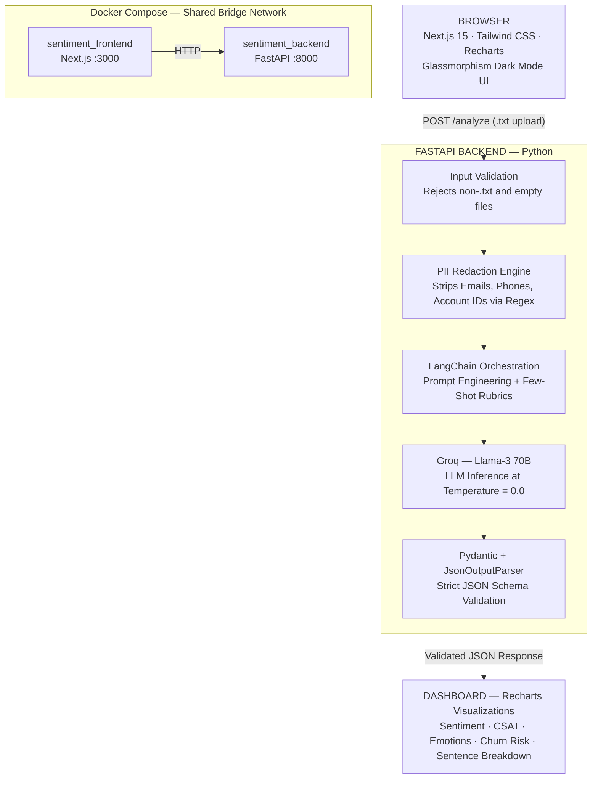

# AI-Powered Sentiment Analyzer - Enterprise Full-Stack

> A production-ready, full-stack AI application for **Tata Tele Business Services (TTBS)** that analyzes customer support transcripts and extracts actionable business insights: Sentiment, Emotion, CSAT, Churn Risk, Empathy Score, and Action Items.

**Live Demo:** [sentiment-analyzer-sand.vercel.app](https://sentiment-analyzer-sand.vercel.app/) — Login: `admin` / `password`

---

## 🎬 Product Walkthrough & Demo

https://github.com/user-attachments/assets/e4fc4f5d-7b26-4b67-959b-452fdea81af3

---

## Architecture



---

## Key Features

### 1. Zero-Trust PII Redaction
Before any transcript reaches the Cloud LLM, a custom Python Regex engine actively strips sensitive data:

| Raw Input | After Redaction |
| :--- | :--- |
| `john@example.com` | `[REDACTED_EMAIL]` |
| `555-123-4567` | `[REDACTED_PHONE]` |
| `Account ID: 849302` | `Account ID: [REDACTED_ACCOUNT]` |

The Cloud AI **never sees raw customer data.**

### 2. Deterministic Anti-Hallucination Guardrails
- **Temperature = 0.0** — Same transcript always produces identical results.
- **Few-Shot Prompting** — Locks the LLM into a strict JSON output pattern.
- **Hardcoded Grading Rubrics** — CSAT scoring rules are explicit, not guessed by the AI.

### 3. Granular Sentence-Level Parsing
The LangChain prompt forces the LLM to split transcripts by literal punctuation (not speaker turns), maximizing mathematical accuracy for the Sentiment Pie Chart.

### 4. Docker Compose Deployment
One command runs the entire production stack:
```bash
docker-compose up --build
```

---

## Tech Stack

| Layer | Technology |
| :--- | :--- |
| Frontend | Next.js 15, Tailwind CSS, Recharts |
| Backend | FastAPI (Python) |
| AI Orchestration | LangChain + JsonOutputParser |
| LLM | Groq — Llama-3 70B (Temperature 0.0) |
| Deployment | Docker Compose + Vercel |

---

## Design Rationale

| Decision | Why |
| :--- | :--- |
| **FastAPI over Next.js API Route** | AI workloads in Python can be scaled independently from the React frontend. Building AI inside a Next.js monolith means you cannot scale the two layers separately in production. |
| **Llama-3 70B over GPT-4o-mini / Gemini Flash** | Small 8B models frequently hallucinate when parsing complex nested JSON schemas. The 70B model has sufficient reasoning capacity to follow strict grading rubrics in a single zero-shot prompt. Additionally, Llama-3 is fully open-source — no OpenAI vendor lock-in for an enterprise like TTBS. |
| **Docker Compose** | Guarantees any engineer or CI/CD pipeline can run the full production-equivalent stack with one command. No Python version conflicts, no manual venv activation. |
| **Temperature = 0.0** | Enterprise reporting requires reproducible outputs. A non-zero temperature means the same transcript could score CSAT 7 one run and CSAT 4 the next — unacceptable for weekly business reviews. |

---

## Error Handling

| Scenario | HTTP Code | Response |
| :--- | :--- | :--- |
| Non-.txt file uploaded | `400` | `"Only .txt files are supported"` |
| Empty file uploaded | `400` | `"The file is empty"` |
| Missing `GROQ_API_KEY` | `500` | `"GROQ_API_KEY environment variable not set"` |
| Groq rate limit (429) | Auto-retry | LangChain retries 3x before raising 500 |
| LLM returns malformed JSON | `500` | JsonOutputParser exception surfaced to caller |

---

## Setup

### Backend (Docker — Full Stack)
```bash
# 1. Add your Groq API key to backend/.env
echo "GROQ_API_KEY=your_key_here" > backend/.env

# 2. Run from the root directory
docker-compose up --build
```

| Service | URL |
| :--- | :--- |
| Frontend | http://localhost:3000 |
| Backend API (Swagger) | http://localhost:8000/docs |

---

## Sample API Response

`POST /analyze` with a `.txt` transcript returns:

```json
{
  "overall_sentiment": "Positive",
  "dominant_emotion": "Relief",
  "csat_estimate": 9,
  "empathy_score": 9,
  "resolution_status": "Resolved",
  "churn_risk": "Low",
  "summary": "Customer called frustrated about a 4-hour outage. Agent confirmed technicians were on-site and offered an account credit, fully resolving the issue.",
  "action_items": [
    { "task": "Issue account credit for today's downtime", "assignee": "Agent" }
  ],
  "sentence_breakdown": [
    { "sentence": "Customer: I'm really frustrated.", "sentiment": "Negative" },
    { "sentence": "Agent: I completely understand.", "sentiment": "Positive" }
  ],
  "redacted_transcript": "Customer: My account [REDACTED_ACCOUNT] has been down for 4 hours."
}
```

---

## Future Roadmap

- **LangGraph Critic Agent** — A second AI agent verifies the first agent's JSON for hallucinations before returning to the user.
- **LiteLLM Failover** — Auto-reroutes to OpenAI/Gemini if Groq hits rate limits (HTTP 429).
- **Microsoft Presidio** — Upgrade PII redaction from Regex to NLP-based entity recognition.
- **MongoDB** — Persist CSAT trends globally for executive-level business intelligence.
